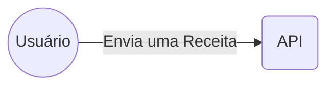
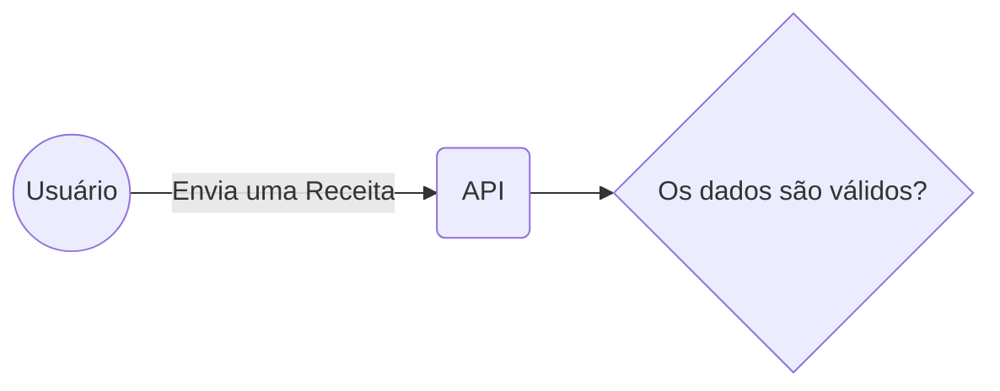
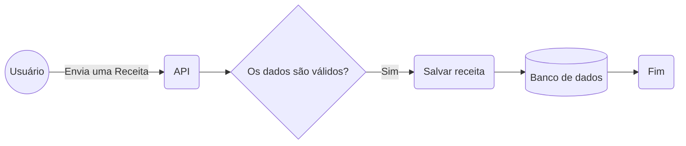
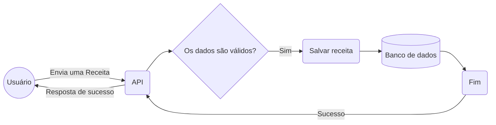
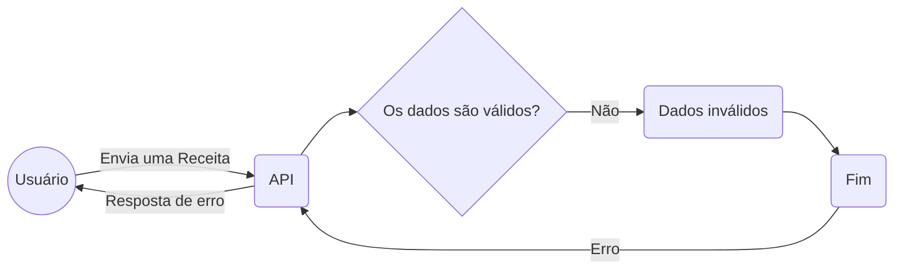
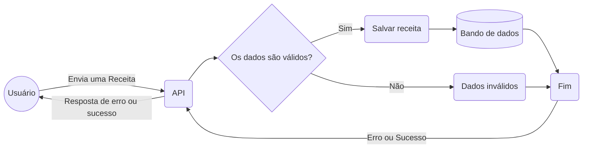

# Fluxo da aplicação
Criação de uma nova receita <uim-angle-double-right class="text-orange-400 animate-pulse" />

---
layout: cover
background: false
---

---
layout: cover
background: false
---

---
layout: cover
background: false
---

---
layout: cover
background: false
---

Retornará `sucesso` para o cliente

---
layout: cover
background: https://images.unsplash.com/photo-1555861496-0666c8981751?ixlib=rb-4.0.3&ixid=MnwxMjA3fDB8MHxwaG90by1wYWdlfHx8fGVufDB8fHx8&auto=format&fit=crop&w=1170&q=80
---

E se der erro na validação?

---
layout: cover
background: false
---

Retornará `erro` para o cliente

---
layout: cover
background: false
---

Fluxograma completo de criação de uma nova `receita`

> A receita só poderá ser salva se todos os dados fornecidos forem válidos

