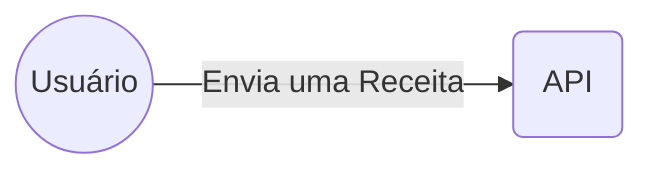
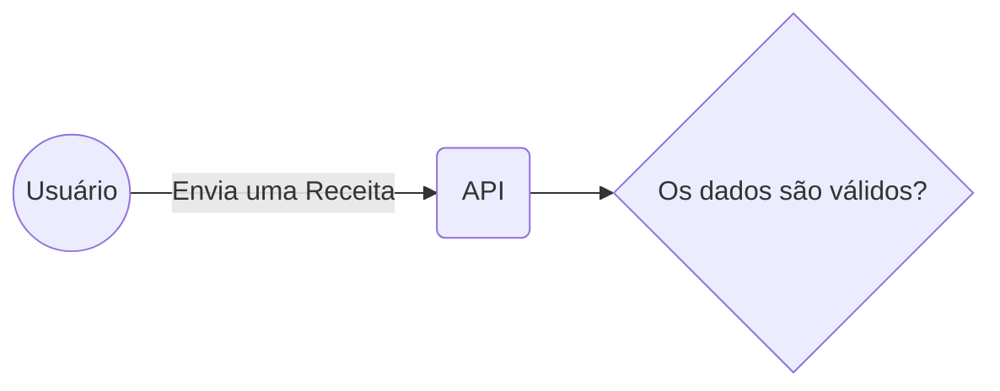
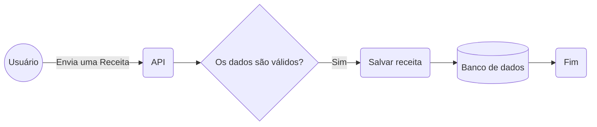
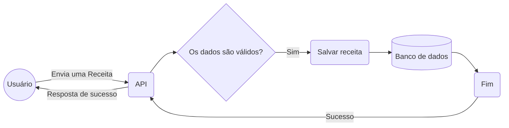
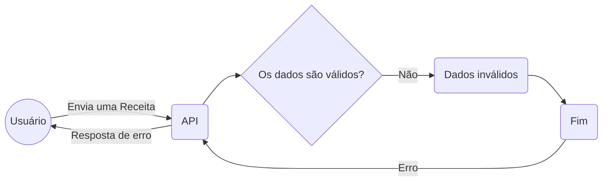
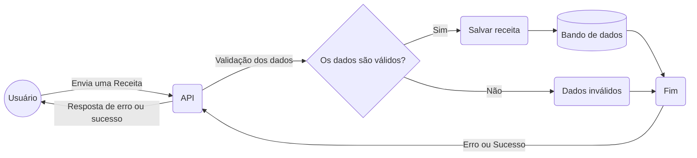

# Fluxo da aplicação

---
layout: cover
background: false
---

---
layout: cover
background: false
---

---
layout: cover
background: false
---

---
layout: cover
background: false
---

---
layout: cover
background: false
---

E se der erro na validação?

---
layout: cover
background: false
---

---

# Fluxo completo de criação de uma receita

A receita só poderá ser salva se todos os dados fornecidos estiverem válidos

