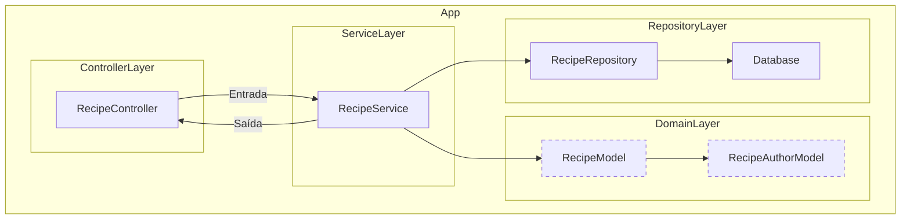

# Como ficaram nossas camadas?

---
layout: section
---
# Resumo das camadas

```mermaid
flowchart LR
    subgraph App
        direction LR
        subgraph ControllerLayer
            RecipeController
        end
        subgraph ServiceLayer
            RecipeService
        end
        subgraph DomainLayer
            RecipeModel
            RecipeAuthorModel
        end
        subgraph RepositoryLayer
            RecipeRepository
            Database
        end
        RecipeController -->|Entrada| RecipeService
        RecipeService -->|Saída| RecipeController
        RecipeService --> RecipeRepository
        RecipeService --> RecipeModel
        RecipeModel --> RecipeAuthorModel
        RecipeRepository --> Database
    end
    style RecipeModel stroke-dasharray: 5 5
    style RecipeAuthorModel stroke-dasharray: 5 5
```
